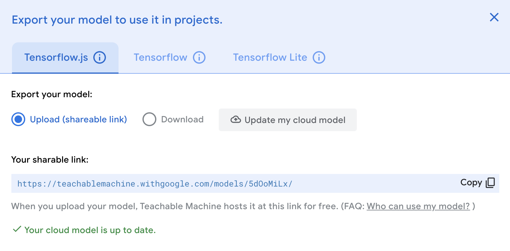
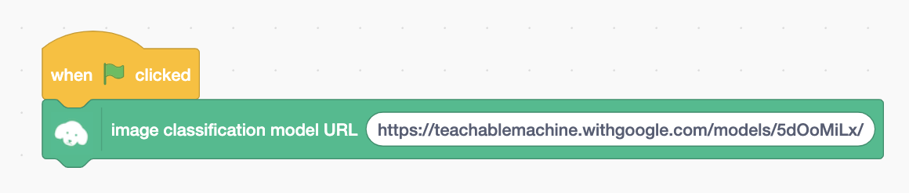
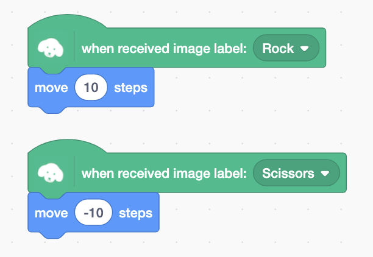
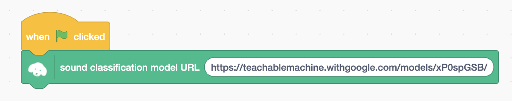
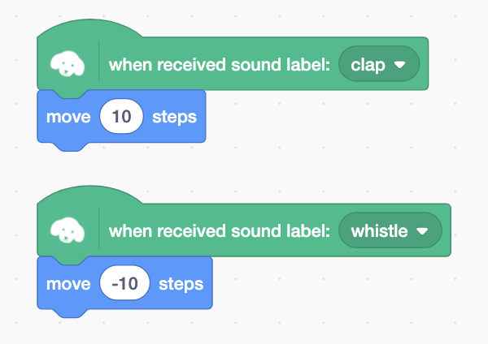

## Request for support

TM2Scratch has been open source and free of charge since 2020, and is used in various places such as schools and various programming classes. In order to continue development, we need support from everyone who uses it.
I would be very grateful if you could support me in the form of [a cup of coffee]((https://www.buymeacoffee.com/champierre)).

<a href="https://www.buymeacoffee.com/champierre"></a>

# TM2Scratch

*Read this in other languages: [English](README.en.md), [日本語](README.md).*

TM2Scratch connects Google Teachable Machine 2 with Scratch 3. You can use image, audio recognition on Scratch project(Please use [TMPose2Scratch](https://github.com/champierre/tmpose2scratch) for pose recognition).

It also supports [Generation AI](https://www.gen-ai.fi/). Generation AI is a free, open educational resource for K-12 (kindergarten through high school). Unlike Google Teachable Machine, which does not work on iPads, Generation AI is compatible with iPads. Furthermore, it is GDPR compliant and designed with privacy in mind, as all processing is performed on the local device.

## License

TM2Scratch is under [AGPL-3.0 license](./LICENSE), open source and freely available to anyone. You can use it at your classes, workshops. Commercial usage is also accepted. If you or your students created something cool using TM2Scratch, please share it on SNS using hashtag #tm2scratch or let me know to any of these contacts.

## Multi-language Support

TM2Scratch supports the following 7 languages:

- 🇯🇵 Japanese (日本語)
- 🇯🇵 Japanese Hiragana (日本語ひらがな)
- 🇺🇸 English
- 🇰🇷 Korean (한국어)
- 🇨🇳 Chinese Simplified (简体中文)
- 🇹🇼 Chinese Traditional (繁體中文)
- 🇩🇪 German (Deutsch)

The language is automatically set in the Stretch3 editor based on your browser's language settings.

## How to use

### Image recognition

1. On [Google Teachable Machine](https://teachablemachine.withgoogle.com/) website, create an image classification model and upload it.

2. Copy the sharable link.

  

3. Open [https://stretch3.github.io/](https://stretch3.github.io/) on Chrome browser.

4. Open "Choose an Extension" window and select "TM2Scratch".

5. Paste the shareble link into the text field of "image classification model URL" block.

  

6. You can use the image recognition results with "when received image label" blocks.

  

### Audio recognition

1. On [Google Teachable Machine](https://teachablemachine.withgoogle.com/) website, create a sound classification model and upload it.

2. Copy the sharable link.

3. Open [https://stretch3.github.io/](https://stretch3.github.io/) on Chrome browser.

4. Open "Choose an Extension" window and select "TM2Scratch".

5. Paste the shareble link into the text field of "sound classification model URL" block.

  

6. You can use the sound recognition results with "when received sound label" blocks.

  

7. **NOTE** The camera image that is trained on the Teachable Machine is a square, whereas the camera image that appears on the Scratch stage is a horizontal rectangle. Note that the horizontal edges of the camera image are ignored, and the image in the center is used to recognize. (This is not a problem as long as the object to be judged is in the center of the image.)

## Advanced Features

TM2Scratch provides advanced blocks for fine-grained control over the recognition process.

### Confidence Threshold

You can adjust the recognition confidence threshold. The default is 0.5 (50%).

- **Block**: "set confidence threshold [number]"
- **Value range**: 0.0 to 1.0
- **Usage**: A higher threshold means only more certain recognitions will trigger. A lower threshold will give you more recognition results but may increase false positives.

```
set confidence threshold to 0.8
```

### Classification Interval

You can set how frequently image and sound classification is performed. The default is once per second.

- **Block**: "Label once every [seconds] seconds"
- **Minimum value**: 0.1 seconds (100 milliseconds)
- **Usage**: Use shorter intervals for faster processing, or longer intervals to save CPU resources.

```
Label once every 0.5 seconds
```

### Video Control

You can control the camera video display.

- **Block**: "turn video [on/off/on flipped]"
- **Options**:
  - **on**: Display camera normally
  - **off**: Turn off camera
  - **on flipped**: Display camera video flipped horizontally (mirror view)

```
turn video on flipped
```

### Classification ON/OFF

You can temporarily pause and resume image and sound classification processing.

- **Block**: "turn classification [on/off]"
- **Usage**: Stopping classification when not needed can improve performance.

```
turn classification off
wait (1) seconds
turn classification on
```

### Camera Switching

If multiple cameras are connected, you can switch between them.

- **Block**: "switch webcam to [device]"
- **Usage**: Select an available camera device from the dropdown menu.

```
switch webcam to [front camera]
```

### Getting Confidence Values

You can get the recognition confidence for each label as a numerical value.

- **Blocks**: "confidence of image [label]", "confidence of sound [label]"
- **Return value**: A number from 0.0 to 1.0 (0% to 100%)
- **Usage**: Useful when you want to execute different actions based on confidence levels.

```
if <(confidence of image [cat]) > [0.9]> then
  say "Very confident it's a cat!"
else
  if <(confidence of image [cat]) > [0.5]> then
    say "Might be a cat"
  end
end
```

## Technical Specifications

### System Requirements

- **Browser**: Google Chrome (recommended)
  - Chrome provides the most stable experience as it uses WebRTC for camera and microphone access
  - HTTPS connection is required (except for localhost)
- **Internet Connection**: Required only for initial model loading
  - Once a model is loaded, it is cached in the browser and works offline

### Camera and Model Specifications

- **Camera Resolution**: 360 × 360 pixels (square)
- **Default Confidence Threshold**: 0.5 (50%)
- **Default Classification Interval**: 1.0 second
- **Minimum Classification Interval**: 0.1 seconds (100 milliseconds)

### Libraries Used

- **[ml5.js](https://ml5js.org/)**: A JavaScript library that makes machine learning easy to use
- **[TensorFlow.js](https://www.tensorflow.org/js)**: Google's JavaScript library for running machine learning in the browser
- **WebGL**: GPU-accelerated image processing

### Sample Model URLs

TM2Scratch includes the following built-in sample model URLs:

- **Image Classification**: `https://teachablemachine.withgoogle.com/models/0rX_3hoH/`
- **Sound Classification**: `https://teachablemachine.withgoogle.com/models/xP0spGSB/`

These models are samples created with Teachable Machine that you can try immediately.

## How TM2Scratch Works

TM2Scratch uses [ml5.js](https://ml5js.org/), a JavaScript library that makes machine learning easy to use. ml5.js itself is built on top of Google's [TensorFlow.js](https://www.tensorflow.org/js), making it ultimately powered by TensorFlow.js.

For rendering images and videos, using a GPU (which can process simple calculations in parallel) is more efficient. TensorFlow.js leverages WebGL to access the GPU from web browsers for machine learning computations. This means that with TensorFlow.js, you can perform machine learning training and classification entirely in the browser, without needing to run Python programs on a GPU-equipped server.

With TM2Scratch, once you load a machine learning model created with Google Teachable Machine, all recognition and classification of webcam footage is performed locally on the machine running the browser. No video is sent to Google or other cloud servers for classification, nor are classification results received from them. In other words, while creating a machine learning model requires communication between you and Google (for sending training footage and receiving classification results via Teachable Machine), once the model is downloaded and loaded, all classification processing in TM2Scratch is performed entirely on your local machine.

## Comparison with ML2Scratch

There is another Scratch extension that enables machine learning: [ML2Scratch](https://github.com/champierre/ml2scratch). Here are the similarities and differences between ML2Scratch and TM2Scratch:

|      |  TM2Scratch  |　ML2Scratch |
| ---- | ---- | ---- |
| Library used | ml5.js (TensorFlow.js) | ml5.js (TensorFlow.js) |
| Where training occurs | Teachable Machine (cloud) | ML2Scratch (local machine) |
| Where classification occurs | TM2Scratch (local machine) | ML2Scratch (local machine) |
| Where models are stored | Google servers or files | Files |
| What can be classified | Images, sounds | Images |
| Advantages | Can curate training footage. Easy to share models via URL when you want to save or use on another machine. | Both training and classification happen in ML2Scratch, making it easier to iterate and refine models while testing programs. Can train and classify stage images instead of just camera images. |
| Disadvantages | Training and classification are separate steps, making iteration less convenient. | Cannot curate training footage. Sharing models across machines requires downloading/uploading model files. |

## Troubleshooting

If you encounter issues while using TM2Scratch, try the following solutions.

### Camera Not Showing

**Causes and Solutions:**

1. **Camera access permission not granted**
   - Click the camera icon in the browser's address bar and allow camera access
   - Check site permissions in Chrome Settings → Privacy and security → Site Settings → Camera

2. **Another application is using the camera**
   - Close video conferencing apps like Zoom, Teams, or Skype, then reload the page

3. **Not using HTTPS connection**
   - For security reasons, camera access requires an HTTPS connection (except for localhost)
   - Make sure you're using `https://stretch3.github.io/`

### Sound Recognition Not Working

**Causes and Solutions:**

1. **Microphone access permission not granted**
   - Click the microphone icon in the browser's address bar and allow microphone access

2. **Sound classification model not loaded correctly**
   - Verify the model URL is correct
   - Check for error messages in the browser console (F12 key)

### Low Recognition Accuracy

**Causes and Solutions:**

1. **Lighting conditions differ from training**
   - Use similar lighting conditions as when you trained the model in Teachable Machine
   - Ensure there is sufficient lighting

2. **Camera position or angle differs from training**
   - Use the camera at the same distance and angle as during training
   - Make sure the recognition target is centered in the camera image

3. **Confidence threshold is too high**
   - Try lowering the threshold with "set confidence threshold to [0.3]"
   - However, too low a threshold may increase false positives

4. **Insufficient training data**
   - Add enough samples (100+ recommended) for each class in Teachable Machine
   - Capture samples from various angles, lighting conditions, and backgrounds

### Cannot Load Model URL

**Causes and Solutions:**

1. **Incorrect URL**
   - Copy the shareable link displayed after "Upload model" in Teachable Machine
   - Make sure the URL ends with `/` (e.g., `https://teachablemachine.withgoogle.com/models/xxxxx/`)

2. **No internet connection**
   - Internet connection is required for initial model loading
   - Check your Wi-Fi or network connection

3. **Model has been deleted**
   - Re-upload your model in Teachable Machine and get a new URL

### Slow or Heavy Processing

**Causes and Solutions:**

1. **Classification interval is too short**
   - Increase the interval with "Label once every [2] seconds"
   - Default is 1 second

2. **Too many tabs or applications open**
   - Close unnecessary browser tabs and applications
   - TM2Scratch uses GPU, which may compete with other heavy processes

3. **Using an old computer**
   - TM2Scratch performs GPU-accelerated image processing, so a relatively modern computer is recommended

### Browser Compatibility

**Supported Browsers:**
- ✅ **Google Chrome** (recommended)
- ⚠️ **Microsoft Edge** (Chromium version only, some features may be unstable)
- ❌ **Safari** (may not work due to different WebGL implementation)
- ❌ **Firefox** (may not work due to different camera access implementation)

For the most stable experience, we strongly recommend using the **latest version of Google Chrome**.

## Frequently Asked Questions (FAQ)

### Q1: What's the difference between TM2Scratch and ML2Scratch?

**A:** The main difference is where training occurs:
- **TM2Scratch**: Train on Google Teachable Machine (cloud), classify in Scratch
- **ML2Scratch**: Train and classify both in Scratch

TM2Scratch allows you to curate training data and makes model sharing easy with just a URL. ML2Scratch allows training and classification in the same place, making iteration easier.

See the "Comparison with ML2Scratch" section for more details.

### Q2: Can I use it on iPad?

**A:** Yes, if you use Generation AI.

TM2Scratch supports Generation AI, which works on iPads. However, Google Teachable Machine itself doesn't work on iPads, so you'll need to create models on a computer and only perform classification on the iPad.

### Q3: Can I use it offline?

**A:** Partially yes.

- **First time**: Internet connection is required to load the model
- **Subsequent times**: The model is cached in the browser, so it works offline

However, the Scratch editor (Stretch3) itself runs online, so you cannot use it completely offline.

### Q4: Can I use it commercially?

**A:** Yes, you can.

TM2Scratch is provided under the AGPL-3.0 license, which permits commercial use. You can freely use it in classes, workshops, commercial projects, etc.

If you create something with it, we'd appreciate if you share it on social media using the hashtag #tm2scratch.

### Q5: Why is the camera image square?

**A:** Because the model trained on Teachable Machine expects square images (360×360 pixels).

The camera footage displayed on the Scratch stage is horizontal, but only the central square area is used for recognition. Make sure to position the object you want to recognize in the center of the camera view.

### Q6: What's the difference between Generation AI and Google Teachable Machine?

**A:** Both are tools for creating machine learning models, but they have the following differences:

| Feature | Google Teachable Machine | Generation AI |
|---------|-------------------------|---------------|
| iPad support | ❌ Not supported | ✅ Supported |
| GDPR compliance | - | ✅ Compliant (privacy-focused) |
| Target users | General users | K-12 (kindergarten to high school) |
| Processing location | Cloud | Local device |

Models created with either tool can be used with TM2Scratch.

### Q7: Can I use multiple models simultaneously?

**A:** You can use one image classification model and one sound classification model simultaneously, for a total of 2 models.

However, you cannot use two image classification models or two sound classification models at the same time. If you want to use a different model, load the new model URL (the previous model will be overwritten).

### Q8: Can I save my own created model as a file?

**A:** Yes, you can.

Teachable Machine allows you to download models and save them as local files. However, TM2Scratch cannot load models directly from local files, so use one of these methods:

1. **Recommended**: Use Teachable Machine's "Upload model" feature to get a shareable URL
2. Host the model file yourself and use that URL

### Q9: Is my privacy protected? Where is data sent?

**A:** TM2Scratch is designed with privacy in mind.

- **When loading models**: Models are downloaded from Google (Teachable Machine) or Generation AI servers
- **When classifying**: All processing is performed in the browser (locally). Camera footage and recognition results are never sent to external servers

In other words, once a model is loaded, all image and sound processing is completed on your computer.

### Q10: What should I do if I encounter an error?

**A:** Try the following steps:

1. **Check browser console**
   - Press F12 to open developer tools and check the "Console" tab for error messages
2. **Reload the page**
   - Press Ctrl+R (Mac: Cmd+R) to reload the page
3. **Clear cache**
   - Press Ctrl+Shift+Delete (Mac: Cmd+Shift+Delete) to clear cache
4. **Check the Troubleshooting section**
   - Look for your issue in the "Troubleshooting" section above
5. **Report an issue**
   - If the above doesn't resolve it, please report it at [GitHub Issues](https://github.com/champierre/tm2scratch/issues)

## For Developers - How to run TM2Scratch extension on your computer

1. Setup LLK/scratch-gui on your computer.

    ```
    % git clone git@github.com:LLK/scratch-gui.git
    % cd scratch-gui
    % npm install
    ```

2. In scratch-gui folder, clone TM2Scratch. You will have tm2scratch folder under scratch-gui.

    ```
    % git clone git@github.com:champierre/tm2scratch.git
    ```

3. Run the install script.

    ```
    % sh tm2scratch/install.sh
    ```

4. Run Scratch, then go to http://localhost:8601/.

    ```
    % npm start
    ```

### Demo & Links

- TM2Scratch + micro:bit Extension

  
