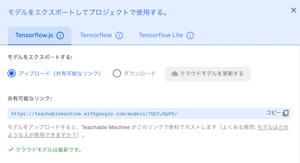
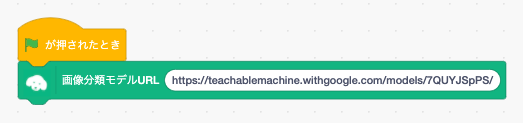
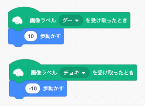
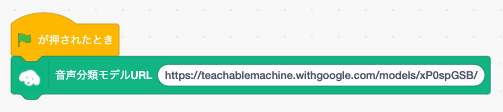
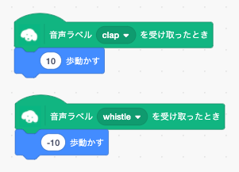

## サポートのお願い

TM2Scratchは2020年よりオープンソースかつ無料で提供しており、学校や各種プログラミング教室はじめさまざまな場所で利用されております。継続して開発を続けるためには、使っていただいている皆さまからの支援が必要です。<br />
[一杯のコーヒー](https://www.buymeacoffee.com/champierre)という形でサポートをいただけると大変ありがたく思います。

<a href="https://www.buymeacoffee.com/champierre"></a>

# TM2Scratch

*他の言語で読む: [English](README.md), [日本語](README.ja.md).*

TM2Scratchは、Google Teachable Machine2で作成した機械学習モデルをScratch3で利用できるようにした拡張機能です。Scratchプロジェクトで画像、音声認識を使用できます（ポーズ認識については[TMPose2Scratch](https://github.com/champierre/tmpose2scratch)をご利用ください）。

## Licence(ライセンス)

- TMScratchには [BSD 3-Clause License](./LICENSE.md) が適用されます。オープンソースで、誰でも自由に利用できます。授業やワークショップで使用でき、商用利用も認められています。あなたやあなたの生徒さんがTM2Scratchを使用して何か面白いプロジェクトを作成したときは、ぜひハッシュタグ #tm2scratch を使用してSNSで共有するか、webmaster@champierre.com までお知らせください。
- 書籍や雑誌、Webメディア上でTM2Scratchを紹介される場合は、以下の文面を掲載いただきたくお願いいたします。

```
TM2Scratchには, BSD 3-Clause Licenseが適用されます。
Copyright (c) 2020, Junya Ishihara(https://github.com/champierre) and Koji Yokokawa(https://github.com/yokobond)
All rights reserved.
```

## 使い方

### 画像認識

1. [Google Teachable Machine](https://teachablemachine.withgoogle.com/)で、画像分類モデルを作成してアップロードします。

2. アップロードしたモデルの共有リンクをコピーします。

  

3. Chromeブラウザで [https://stretch3.github.io/](https://stretch3.github.io/) を開きます。

4. 「拡張機能の選択」ウィンドウを開き、「TM2Scratch」を選択します。

5. 2.でコピーしたリンクを「画像分類モデルURL」ブロックのテキストフィールドに貼り付けます。

  

6. 「画像ラベル○○を受け取ったとき」ブロックで画像認識結果を使用できます。

  

7. **注意** Teachable Machineで学習するカメラ画像は正方形であるのに対して、Scratchのステージに映るカメラ画像は横長の長方形です。カメラ画像の両横端は無視され、中央に映っている画像が判定に使われることに注意してください。(判定したいものを真ん中に映す通常の使い方をしている限りは問題ありません)

### 音声認識

1. [Google Teachable Machine](https://teachablemachine.withgoogle.com/)で、音声分類モデルを作成してアップロードします。

2. アップロードしたモデルの共有リンクをコピーします。

3. Chromeブラウザで [https://stretch3.github.io/](https://stretch3.github.io/) を開きます。

4. 「拡張機能の選択」ウィンドウを開き、「TM2Scratch」を選択します。

5. 2.でコピーしたリンクを「音声分類モデルURL」ブロックのテキストフィールドに貼り付けます。

  

6. 「音声ラベル○○を受け取ったとき」ブロックで音声認識結果を使用できます。

  

## TM2Scratchの仕組み

TM2Scratchは機械学習を簡単に利用できるようにしたJavaScriptライブラリ[ml5.js](https://ml5js.org/)を使っています。ml5.js自体はGoogleが提供している[TensorFlow.js](https://www.tensorflow.org/js?hl=ja)をもっと手軽に利用できるようにしたものなので、おおもとではTensorFlow.jsを使っていると言えます。

画像や映像を描画するときは、単純な計算を並行して同時に処理できるGPUを使うほうが適しています。このGPUをウェブブラウザから利用できるWebGLを、機械学習のための計算に利用しようというのがTensorFlow.jsです。つまりTensorFlow.jsを使えば、GPUを積んだサーバー上でPythonなどで書かれたプログラムを実行しなくても、ブラウザだけで機械学習の学習や分類といった処理をおこなうことができるのです。

TM2Scratchは、Google Teachable Machineを使って作成した画像あるいは音声を分類できる機械学習モデルを最初に一度だけ読み込んだあとは、Webカメラに映った映像の認識・分類はブラウザが起動しているマシン上ですべておこなわれます。分類のために、Googleやそのほかのクラウド上のサーバーに映像を送ったり、分類結果を受け取ったりということはありません。つまり、機械学習モデルを作成するときにはGoogle Teachable Machineを使うので、学習のための映像を送ったり分類結果を受け取るというやりとりはユーザーとGoogleの間でおこなわれますが、そうして作成された機械学習モデルを一度ダウンロードして読み込んだあとは、TM2Scratchでおこなわれる分類などの処理はマシン上で完結しています。

## ML2Scratchとの比較

機械学習を利用できるScratch拡張機能には、別に[ML2Scratch](https://github.com/champierre/ml2scratch)があります。ML2ScratchとTM2Scratchとの共通点、違いは以下の通りです。

|      |  TM2Scratch  |　ML2Scratch |
| ---- | ---- | ---- |
| 使っているライブラリ | ml5.js(TensorFlow.js) | ml5.js(TensorFlow.js) |
| 学習をおこなう場所 | Teachable Machine(クラウド上) | ML2Scratch(マシン上) |
| 分類をおこなう場所 | TM2Scratch(マシン上) | ML2Scratch(マシン上) |
| 機械学習モデルの保存場所 | Googleのサーバー上 or ファイル | ファイル |
| 分類できるもの | 画像、音声 | 画像 |
| 長所 | 学習に使用する映像を選別することができる。作成した機械学習モデル保存したい、あるいは別のマシンで使いたいという場合は共有用のURLのやりとりだけで済むため手軽。| 学習も分類もML2Scratch上でできるため、モデルを修正しながらプログラムを試すといった試行錯誤がしやすい。カメラ画像の代わりにステージの画像も学習、分類することができる。 |
| 短所 | 学習と分類で2段階に分かれているため、モデルを修正しながらプログラムを試すといった試行錯誤がしにくい。 | 学習に使用する映像の選別はできない。作成した機械学習モデルを保存したい、あるいは別のマシンで使いたいという場合はモデルのファイルをダウンロード/アップロードするという手間が必要。|

## For Developers - How to run TM2Scratch extension on your computer

1. Setup LLK/scratch-gui on your computer.

    ```
    % git clone git@github.com:LLK/scratch-gui.git
    % cd scratch-gui
    % npm install
    ```

2. In scratch-gui folder, clone TM2Scratch. You will have tm2scratch folder under scratch-gui.

    ```
    % git clone git@github.com:champierre/tm2scratch.git
    ```

3. Run the install script.

    ```
    % sh tm2scratch/install.sh
    ```

4. Run Scratch, then go to http://localhost:8601/.

    ```
    % npm start
    ```
