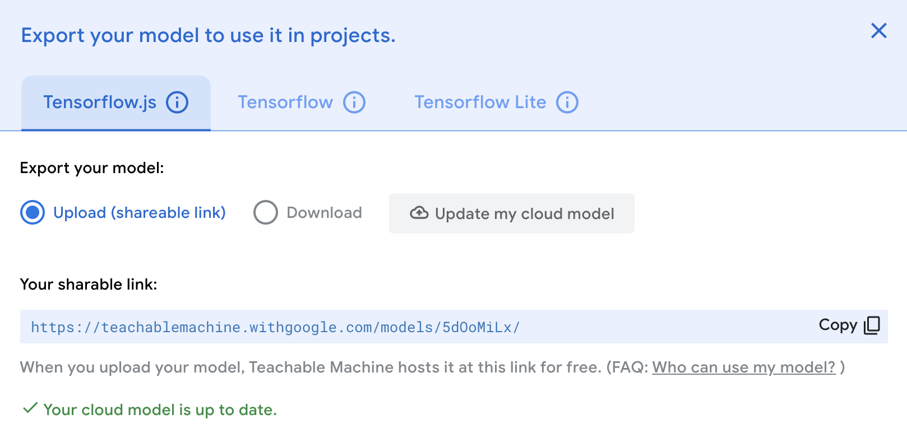
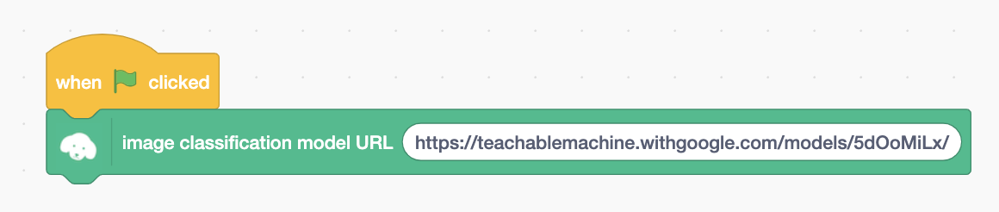
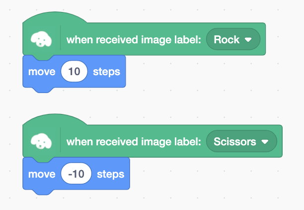
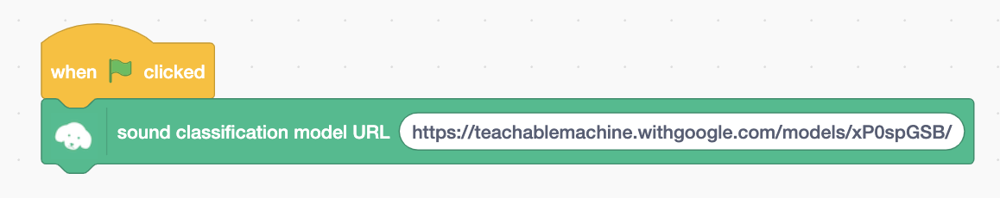
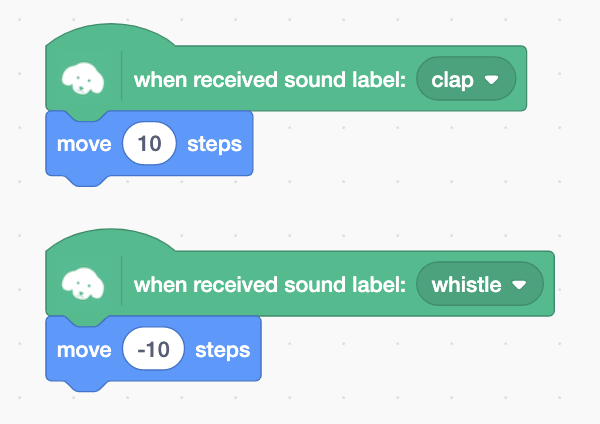

# TM2Scratch

TM2Scratch connects Google Teachable Machine 2 with Scratch 3. You can use image, audio recognition on Scratch project (pose recognition to be released in near future).

## How to use

### Image recognition

1. On [Google Teachable Machine 2](https://teachablemachine.withgoogle.com/) website, create an image classification model and upload it.

2. Copy the sharable link.

  

3. Open http://champierre.github.io/tm2scratch on Chrome browser.

4. Open "Choose an Extension" window and select "TM2Scratch".

5. Paste the shareble link into the text field of "image classification model URL" block.

  

6. You can use the image recognition results with "when received image label" blocks.

  

### Audio recognition

1. On [Google Teachable Machine](https://teachablemachine.withgoogle.com/) website, create a sound classification model and upload it.

2. Copy the sharable link.

3. Open http://champierre.github.io/tm2scratch on Chrome browser.

4. Open "Choose an Extension" window and select "TM2Scratch".

5. Paste the shareble link into the text field of "sound classification model URL" block.

  

6. You can use the sound recognition results with "when received sound label" blocks.

  

## For Developers - How to run TM2Scratch extension on your computer

1. Setup LLK/scratch-gui on your computer.

    ```
    % git clone git@github.com:LLK/scratch-gui.git
    % cd scratch-gui
    % npm install
    ```

2. In scratch-gui folder, clone TM2Scratch. You will have tm2scratch folder under scratch-gui.

    ```
    % git clone git@github.com:champierre/tm2scratch.git
    ```

3. Run the install script.

    ```
    % sh tm2scratch/install.sh
    ```

4. Run Scratch, then go to http://localhost:8601/.

    ```
    % npm start
    ```
