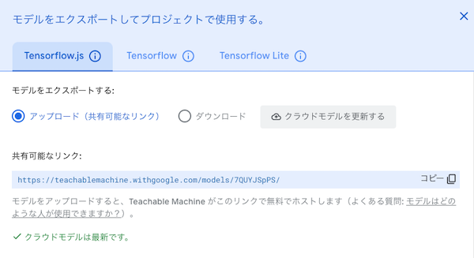
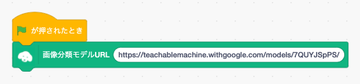
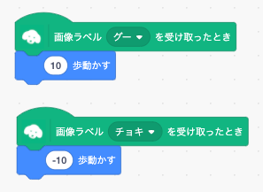
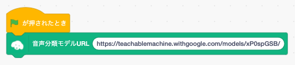
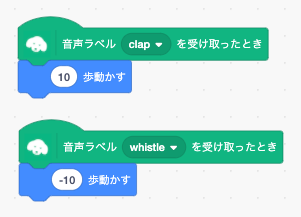

## サポートのお願い

TM2Scratchは2020年よりオープンソースかつ無料で提供しており、学校や各種プログラミング教室はじめさまざまな場所で利用されております。継続して開発を続けるためには、使っていただいている皆さまからの支援が必要です。<br />
[一杯のコーヒー](https://www.buymeacoffee.com/champierre)という形でサポートをいただけると大変ありがたく思います。

<a href="https://www.buymeacoffee.com/champierre"></a>

# TM2Scratch

*他の言語で読む: [English](README.en.md), [日本語](README.md).*

TM2Scratchは、Google Teachable Machine2で作成した機械学習モデルをScratch3で利用できるようにした拡張機能です。Scratchプロジェクトで画像、音声認識を使用できます（ポーズ認識については[TMPose2Scratch](https://github.com/champierre/tmpose2scratch)をご利用ください）。

また、[Generation AI](https://www.gen-ai.fi/)もサポートしています。Generation AIは、K-12（幼稚園から高校まで）向けの無料・オープン教育リソースで、Google Teachable MachineがiPadでは動作しないのに対して、iPadでも利用できます。さらに、GDPR準拠で、すべての処理がローカルデバイスで実行されるため、プライバシーに配慮した設計となっています。

## Licence(ライセンス)

- TMScratchには [AGPL-3.0 license](./LICENSE) が適用されます。オープンソースで、誰でも自由に利用できます。授業やワークショップで使用でき、商用利用も認められています。あなたやあなたの生徒さんがTM2Scratchを使用して何か面白いプロジェクトを作成したときは、ぜひハッシュタグ #tm2scratch を使用してSNSで共有するか、webmaster@champierre.com までお知らせください。
- 書籍や雑誌、Webメディア上でTM2Scratchを紹介される場合は、以下の文面を掲載いただきたくお願いいたします。

```
TM2Scratchには, AGPL-3.0 Licenseが適用されます。
Copyright (c) 2020, Junya Ishihara(https://github.com/champierre) and Koji Yokokawa(https://github.com/yokobond)
All rights reserved.
```

## 多言語サポート

TM2Scratchは以下の7言語に対応しています：

- 🇯🇵 日本語（Japanese）
- 🇯🇵 日本語ひらがな（Japanese Hiragana）
- 🇺🇸 英語（English）
- 🇰🇷 韓国語（Korean）
- 🇨🇳 中国語簡体字（Chinese Simplified）
- 🇹🇼 中国語繁体字（Chinese Traditional）
- 🇩🇪 ドイツ語（German）

言語は Stretch3 エディタで自動的に設定されます。ブラウザの言語設定に基づいて適切な言語が選択されます。

## 使い方

### 画像認識

1. [Google Teachable Machine](https://teachablemachine.withgoogle.com/)で、画像分類モデルを作成してアップロードします。

2. アップロードしたモデルの共有リンクをコピーします。

  

3. Chromeブラウザで [https://stretch3.github.io/](https://stretch3.github.io/) を開きます。

4. 「拡張機能の選択」ウィンドウを開き、「TM2Scratch」を選択します。

5. 2.でコピーしたリンクを「画像分類モデルURL」ブロックのテキストフィールドに貼り付けます。

  

6. 「画像ラベル○○を受け取ったとき」ブロックで画像認識結果を使用できます。

  

7. **注意** Teachable Machineで学習するカメラ画像は正方形であるのに対して、Scratchのステージに映るカメラ画像は横長の長方形です。カメラ画像の両横端は無視され、中央に映っている画像が判定に使われることに注意してください。(判定したいものを真ん中に映す通常の使い方をしている限りは問題ありません)

### 音声認識

1. [Google Teachable Machine](https://teachablemachine.withgoogle.com/)で、音声分類モデルを作成してアップロードします。

2. アップロードしたモデルの共有リンクをコピーします。

3. Chromeブラウザで [https://stretch3.github.io/](https://stretch3.github.io/) を開きます。

4. 「拡張機能の選択」ウィンドウを開き、「TM2Scratch」を選択します。

5. 2.でコピーしたリンクを「音声分類モデルURL」ブロックのテキストフィールドに貼り付けます。

  

6. 「音声ラベル○○を受け取ったとき」ブロックで音声認識結果を使用できます。

  

## 高度な機能

TM2Scratchには、より細かい制御を可能にする高度なブロックが用意されています。

### 確度のしきい値（Confidence Threshold）

認識の信頼度を調整できます。デフォルトは 0.5（50%）です。

- **ブロック**: 「確度のしきい値を[数値]にする」
- **値の範囲**: 0.0 〜 1.0
- **使い方**: しきい値を高くすると、より確実な認識のみが反応します。低くすると、より多くの認識結果を得られますが、誤認識も増える可能性があります。

```
確度のしきい値を 0.8 にする
```

### 分類間隔（Classification Interval）

画像・音声の分類をどのくらいの頻度で行うかを設定できます。デフォルトは 1秒に1回です。

- **ブロック**: 「ラベル付けを[秒数]秒間に1回行う」
- **最小値**: 0.1秒（100ミリ秒）
- **使い方**: 処理を高速化したい場合は短い間隔を、CPUリソースを節約したい場合は長い間隔を設定します。

```
ラベル付けを 0.5 秒間に1回行う
```

### ビデオの制御

カメラ映像の表示を制御できます。

- **ブロック**: 「ビデオを[入/切/左右反転]にする」
- **オプション**:
  - **入**: カメラを通常表示
  - **切**: カメラをオフ
  - **左右反転**: カメラ映像を左右反転して表示（鏡のように表示）

```
ビデオを 左右反転 にする
```

### ラベル付けの ON/OFF

画像・音声の分類処理を一時的に停止・再開できます。

- **ブロック**: 「ラベル付けを[入/切]にする」
- **使い方**: 分類が不要な時に処理を停止することで、パフォーマンスを向上させることができます。

```
ラベル付けを 切 にする
待つ (1) 秒
ラベル付けを 入 にする
```

### カメラの切り替え

複数のカメラが接続されている場合、使用するカメラを切り替えることができます。

- **ブロック**: 「カメラを[デバイス]に切り替える」
- **使い方**: ドロップダウンメニューから利用可能なカメラデバイスを選択します。

```
カメラを [前面カメラ] に切り替える
```

### 確度（Confidence）の取得

各ラベルの認識確度を数値として取得できます。

- **ブロック**: 「画像ラベル[ラベル名]の確度」「音声ラベル[ラベル名]の確度」
- **戻り値**: 0.0 〜 1.0 の数値（0% 〜 100%）
- **使い方**: 認識の信頼度に応じて異なる処理を実行する場合に便利です。

```
もし <(画像ラベル [猫] の確度) > [0.9]> なら
  「とても確実に猫が見つかりました！」と言う
でなければ
  もし <(画像ラベル [猫] の確度) > [0.5]> なら
    「猫がいるかもしれません」と言う
  end
end
```

## 技術仕様

### システム要件

- **ブラウザ**: Google Chrome（推奨）
  - カメラとマイクへのアクセスに WebRTC を使用しているため、Chrome が最も安定して動作します
  - HTTPS 接続が必要です（localhost を除く）
- **インターネット接続**: 機械学習モデルの初回読み込み時のみ必要
  - モデルを一度読み込んだ後は、ブラウザのキャッシュに保存されるため、オフラインでも動作します

### カメラとモデルの仕様

- **カメラ解像度**: 360 × 360 ピクセル（正方形）
- **デフォルト確度のしきい値**: 0.5（50%）
- **デフォルト分類間隔**: 1.0秒
- **最小分類間隔**: 0.1秒（100ミリ秒）

### 使用ライブラリ

- **[ml5.js](https://ml5js.org/)**: 機械学習を簡単に利用できるようにした JavaScript ライブラリ
- **[TensorFlow.js](https://www.tensorflow.org/js)**: Google が提供する、ブラウザで機械学習を実行できる JavaScript ライブラリ
- **WebGL**: GPU を使った高速な画像処理

### サンプルモデル URL

TM2Scratch には以下のサンプルモデル URL が組み込まれています：

- **画像分類**: `https://teachablemachine.withgoogle.com/models/0rX_3hoH/`
- **音声分類**: `https://teachablemachine.withgoogle.com/models/xP0spGSB/`

これらのモデルは、Teachable Machine で作成されたサンプルで、すぐに試すことができます。

## TM2Scratchの仕組み

TM2Scratchは機械学習を簡単に利用できるようにしたJavaScriptライブラリ[ml5.js](https://ml5js.org/)を使っています。ml5.js自体はGoogleが提供している[TensorFlow.js](https://www.tensorflow.org/js?hl=ja)をもっと手軽に利用できるようにしたものなので、おおもとではTensorFlow.jsを使っていると言えます。

画像や映像を描画するときは、単純な計算を並行して同時に処理できるGPUを使うほうが適しています。このGPUをウェブブラウザから利用できるWebGLを、機械学習のための計算に利用しようというのがTensorFlow.jsです。つまりTensorFlow.jsを使えば、GPUを積んだサーバー上でPythonなどで書かれたプログラムを実行しなくても、ブラウザだけで機械学習の学習や分類といった処理をおこなうことができるのです。

TM2Scratchは、Google Teachable Machineを使って作成した画像あるいは音声を分類できる機械学習モデルを最初に一度だけ読み込んだあとは、Webカメラに映った映像の認識・分類はブラウザが起動しているマシン上ですべておこなわれます。分類のために、Googleやそのほかのクラウド上のサーバーに映像を送ったり、分類結果を受け取ったりということはありません。つまり、機械学習モデルを作成するときにはGoogle Teachable Machineを使うので、学習のための映像を送ったり分類結果を受け取るというやりとりはユーザーとGoogleの間でおこなわれますが、そうして作成された機械学習モデルを一度ダウンロードして読み込んだあとは、TM2Scratchでおこなわれる分類などの処理はマシン上で完結しています。

## ML2Scratchとの比較

機械学習を利用できるScratch拡張機能には、別に[ML2Scratch](https://github.com/champierre/ml2scratch)があります。ML2ScratchとTM2Scratchとの共通点、違いは以下の通りです。

|      |  TM2Scratch  |　ML2Scratch |
| ---- | ---- | ---- |
| 使っているライブラリ | ml5.js(TensorFlow.js) | ml5.js(TensorFlow.js) |
| 学習をおこなう場所 | Teachable Machine(クラウド上) | ML2Scratch(マシン上) |
| 分類をおこなう場所 | TM2Scratch(マシン上) | ML2Scratch(マシン上) |
| 機械学習モデルの保存場所 | Googleのサーバー上 or ファイル | ファイル |
| 分類できるもの | 画像、音声 | 画像 |
| 長所 | 学習に使用する映像を選別することができる。作成した機械学習モデル保存したい、あるいは別のマシンで使いたいという場合は共有用のURLのやりとりだけで済むため手軽。| 学習も分類もML2Scratch上でできるため、モデルを修正しながらプログラムを試すといった試行錯誤がしやすい。カメラ画像の代わりにステージの画像も学習、分類することができる。 |
| 短所 | 学習と分類で2段階に分かれているため、モデルを修正しながらプログラムを試すといった試行錯誤がしにくい。 | 学習に使用する映像の選別はできない。作成した機械学習モデルを保存したい、あるいは別のマシンで使いたいという場合はモデルのファイルをダウンロード/アップロードするという手間が必要。|

## トラブルシューティング

TM2Scratch の使用中に問題が発生した場合は、以下の解決策を試してください。

### カメラが表示されない

**原因と解決策:**

1. **カメラへのアクセス権限が許可されていない**
   - ブラウザのアドレスバーにあるカメラアイコンをクリックし、カメラへのアクセスを許可してください
   - Chrome の設定 → プライバシーとセキュリティ → サイトの設定 → カメラ でサイトの権限を確認してください

2. **他のアプリケーションがカメラを使用している**
   - Zoom、Teams、Skype などのビデオ会議アプリを閉じてから、ページを再読み込みしてください

3. **HTTPS 接続ではない**
   - セキュリティ上の理由から、カメラへのアクセスには HTTPS 接続が必要です（localhost は除く）
   - `https://stretch3.github.io/` を使用していることを確認してください

### 音声認識が動作しない

**原因と解決策:**

1. **マイクへのアクセス権限が許可されていない**
   - ブラウザのアドレスバーにあるマイクアイコンをクリックし、マイクへのアクセスを許可してください

2. **音声分類モデルが正しく読み込まれていない**
   - モデル URL が正しいか確認してください
   - ブラウザのコンソール（F12キー）でエラーメッセージを確認してください

### 認識精度が低い

**原因と解決策:**

1. **照明条件が学習時と異なる**
   - Teachable Machine で学習した時と同じような照明条件で使用してください
   - 明るさが十分にあることを確認してください

2. **カメラの位置や角度が学習時と異なる**
   - 学習時と同じ距離・角度でカメラを使用してください
   - カメラ画像の中央に認識対象が映るようにしてください

3. **確度のしきい値が高すぎる**
   - 「確度のしきい値を [0.3] にする」などで、しきい値を下げてみてください
   - ただし、低すぎると誤認識が増える可能性があります

4. **学習データが不足している**
   - Teachable Machine で各クラスに十分なサンプル（100枚以上推奨）を追加してください
   - さまざまな角度・照明・背景でサンプルを撮影してください

### モデル URL が読み込めない

**原因と解決策:**

1. **URL が正しくない**
   - Teachable Machine の「モデルをアップロード」後に表示される共有リンクをコピーしてください
   - URL の最後に `/` が含まれていることを確認してください（例: `https://teachablemachine.withgoogle.com/models/xxxxx/`）

2. **インターネット接続がない**
   - モデルの初回読み込み時にはインターネット接続が必要です
   - Wi-Fi またはネットワーク接続を確認してください

3. **モデルが削除されている**
   - Teachable Machine でモデルを再度アップロードし、新しい URL を取得してください

### 処理が遅い・重い

**原因と解決策:**

1. **分類間隔が短すぎる**
   - 「ラベル付けを [2] 秒間に1回行う」などで、分類間隔を長くしてください
   - デフォルトは1秒です

2. **他のタブやアプリケーションが多く開いている**
   - 不要なブラウザタブやアプリケーションを閉じてください
   - TM2Scratch は GPU を使用するため、他の重い処理と競合する可能性があります

3. **古いコンピュータを使用している**
   - TM2Scratch は GPU を使った画像処理を行うため、比較的新しいコンピュータでの使用を推奨します

### ブラウザの互換性

**対応ブラウザ:**
- ✅ **Google Chrome**（推奨）
- ⚠️ **Microsoft Edge**（Chromium版のみ、一部機能が不安定な場合があります）
- ❌ **Safari**（WebGL の実装が異なるため、動作しない場合があります）
- ❌ **Firefox**（カメラアクセスの実装が異なるため、動作しない場合があります）

最も安定した動作のために、**Google Chrome の最新版**を使用することを強く推奨します。

## よくある質問（FAQ）

### Q1: TM2Scratch と ML2Scratch の違いは何ですか？

**A:** 主な違いは学習を行う場所です：
- **TM2Scratch**: Google Teachable Machine（クラウド）で学習し、Scratch で分類を実行
- **ML2Scratch**: Scratch 上で学習も分類も実行

TM2Scratch は学習データの選別ができ、モデルの共有が URL だけで簡単にできます。一方、ML2Scratch は学習と分類を同じ場所でできるため、試行錯誤がしやすいという利点があります。

詳細は「ML2Scratchとの比較」セクションをご覧ください。

### Q2: iPad で使用できますか？

**A:** はい、Generation AI を使用すれば iPad でも利用可能です。

TM2Scratch は Generation AI をサポートしており、Generation AI は iPad でも動作します。ただし、Google Teachable Machine 自体は iPad では動作しないため、モデルの作成はパソコンで行い、iPad では分類のみを実行することになります。

### Q3: オフラインで使用できますか？

**A:** 部分的に可能です。

- **初回**: モデルを読み込む際にはインターネット接続が必要です
- **2回目以降**: モデルがブラウザのキャッシュに保存されるため、オフラインでも使用できます

ただし、Scratch エディタ（Stretch3）自体はオンラインで動作するため、完全にオフラインで使用することはできません。

### Q4: 商用利用は可能ですか？

**A:** はい、可能です。

TM2Scratch は AGPL-3.0 ライセンスの下で提供されており、商用利用も認められています。授業、ワークショップ、商用プロジェクトなどで自由にご利用いただけます。

作品を作成した際は、ハッシュタグ #tm2scratch を使って SNS で共有していただけると嬉しいです。

### Q5: カメラ画像が正方形になるのはなぜですか？

**A:** Teachable Machine で学習したモデルが正方形の画像（360×360ピクセル）を期待しているためです。

Scratch のステージに表示されるカメラ映像は横長ですが、実際に認識に使われるのは中央部分の正方形の領域です。認識させたい対象は、カメラ映像の中央に配置するようにしてください。

### Q6: Generation AI と Google Teachable Machine の違いは何ですか？

**A:** 両方とも機械学習モデルを作成できるツールですが、以下の違いがあります：

| 特徴 | Google Teachable Machine | Generation AI |
|------|-------------------------|---------------|
| iPad 対応 | ❌ 非対応 | ✅ 対応 |
| GDPR 準拠 | - | ✅ 対応（プライバシー重視） |
| 対象ユーザー | 一般ユーザー | K-12（幼稚園〜高校） |
| 処理場所 | クラウド | ローカルデバイス |

どちらのツールで作成したモデルも TM2Scratch で使用できます。

### Q7: 複数のモデルを同時に使用できますか？

**A:** 画像分類モデルと音声分類モデルを1つずつ、合計2つのモデルを同時に使用できます。

ただし、画像分類モデルを2つ、または音声分類モデルを2つ同時に使用することはできません。別のモデルを使用したい場合は、新しいモデル URL を読み込んでください（前のモデルは上書きされます）。

### Q8: 自分で作成したモデルをファイルとして保存できますか？

**A:** はい、可能です。

Teachable Machine では、モデルをダウンロードしてローカルファイルとして保存できます。ただし、TM2Scratch でローカルファイルから直接モデルを読み込むことはできないため、以下のいずれかの方法を使用してください：

1. **推奨**: Teachable Machine の「モデルをアップロード」機能を使い、共有 URL を取得する
2. モデルファイルを自分でホスティングし、その URL を使用する

### Q9: プライバシーは保護されますか？データはどこに送信されますか？

**A:** TM2Scratch はプライバシーに配慮した設計になっています。

- **モデル読み込み時**: Google（Teachable Machine）または Generation AI のサーバーからモデルをダウンロード
- **分類実行時**: すべての処理がブラウザ上（ローカル）で実行されます。カメラ映像や認識結果が外部サーバーに送信されることはありません

つまり、モデルを一度読み込んだ後は、すべての画像・音声処理がお使いのコンピュータ上で完結します。

### Q10: エラーが発生した場合はどうすればいいですか?

**A:** 以下の手順を試してください：

1. **ブラウザのコンソールを確認**
   - F12キーを押して開発者ツールを開き、「Console」タブでエラーメッセージを確認
2. **ページを再読み込み**
   - Ctrl+R（Mac: Cmd+R）でページを再読み込み
3. **キャッシュをクリア**
   - Ctrl+Shift+Delete（Mac: Cmd+Shift+Delete）でキャッシュをクリア
4. **トラブルシューティングセクションを確認**
   - 上記の「トラブルシューティング」セクションで該当する問題を探す
5. **Issue を報告**
   - 上記で解決しない場合は、[GitHub Issues](https://github.com/champierre/tm2scratch/issues) で報告してください

## 事例紹介

- 野田学園中学校の取り組み、高齢者の方でも体を動かして楽しめる「AIデジタルゆるスポーツ」の作品を作るためにStretch3とTM2Scratchが使われています。
  - [野田学園「シニアのためのプログラミング」【つながる絵本～for SDGs～】#399](https://www.youtube.com/watch?v=lGRt536Ud8s)
- 文部科学省 学習指導要領の教師向け参考資料、[中学校技術・家庭科（技術分野）](https://www.mext.go.jp/a_menu/shotou/new-cs/senseiouen/mext_02685.html)の総合的な問題を扱った事例としてTM2Scratchと[MicroBit More](https://microbit-more.github.io/index-ja.html)が紹介されています。
  - [統合的な問題を扱った事例2](https://www.mext.go.jp/content/20240326-mxt_kyoiku01-000034969_8.pdf)
  - [AIデジタルおもちゃで幼児の遊びをサポートしよう！（構想と製作）](https://www.youtube.com/watch?v=ime4bYVI8zg)

## For Developers - How to run TM2Scratch extension on your computer

1. Setup LLK/scratch-gui on your computer.

    ```
    % git clone --depth 1 git@github.com:LLK/scratch-gui.git
    % cd scratch-gui
    % npm install
    ```

2. In scratch-gui folder, clone TM2Scratch. You will have tm2scratch folder under scratch-gui.

    ```
    % git clone git@github.com:champierre/tm2scratch.git
    ```

3. Run the install script.

    ```
    % sh tm2scratch/install.sh
    ```

4. Run Scratch, then go to http://localhost:8601/.

    ```
    % npm start
    ```
